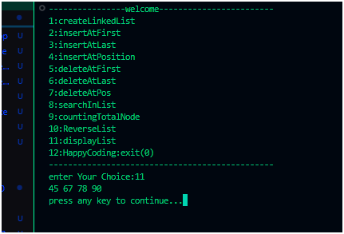

# Linked List Menu-Driven Program (C)

This repository contains a **menu-driven program in C** to perform different operations on a singly linked list.  
The program provides options such as insertion, deletion, searching, counting nodes, reversing the list, and displaying the linked list.

---

## 🚀 Features
- Create Linked List
- Insert at First / Last / Any Position
- Delete from First / Last / Any Position
- Search an Element
- Count Total Nodes
- Reverse the List
- Display the List
- Exit Option

---

## 📋 Menu Screenshot
Here’s the menu you’ll see when you run the program:




## 🛠️ How to Run
1. Clone this repository:
   ```bash
   git clone https://github.com/your-username/linked-list-menu.git
